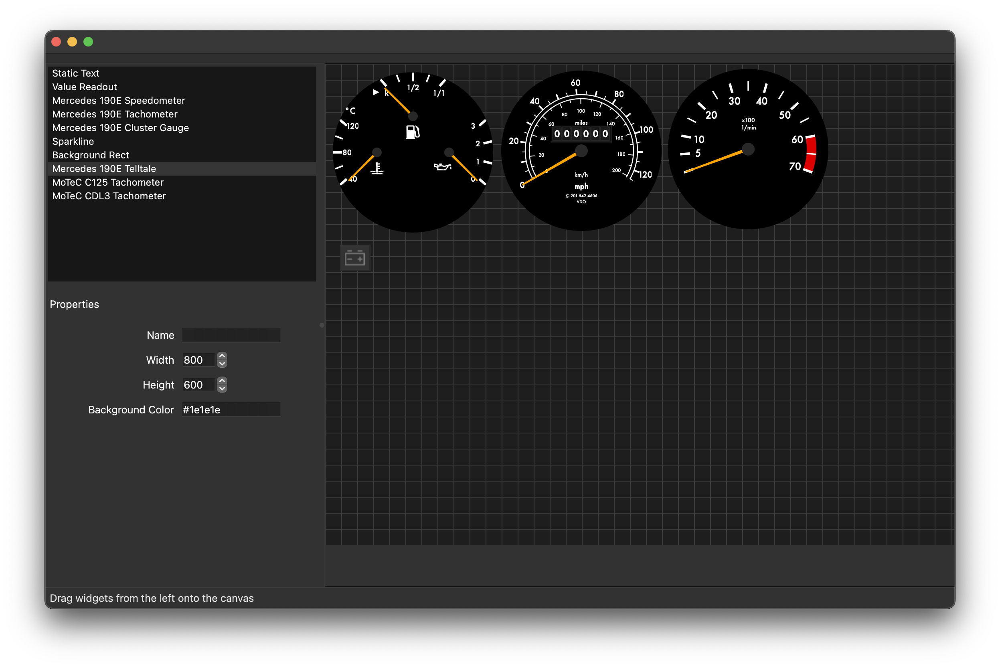

# Redline Labs Digital Dash

An open, hackable instrument cluster for vehicles.

Every gauge is drawn, not a bitmap. One YAML file describes the whole layout:
which widgets, where, how each one is configured, and which signal drives it.
Anything on the vehicle bus can drive anything on the screen through a short
expression. The same binaries run on the target hardware and on a desktop, so
a layout can be built and checked on a laptop before it ever sees the car.

It is for someone who wants a cluster that works out of the box and can be bent
to their own car, from changing a redline to adding a widget or a hardware
bridge that nobody has written yet.

## What it looks like

Mercedes 190E cluster, with a sparklines widget on the right:


MoTeC CDL2 and C125 layouts, the same binary with a different file:


Wired CarPlay, no dongle, as a window on the same display or a second one:


The layout editor:



## What you get

The **dashboard** renders a layout across one or more displays, and the
**editor** builds that layout by dragging widgets onto a canvas and setting
their properties. Both work on a laptop with nothing attached.

**Native wired CarPlay.** The phone talks to a driver node over USB and its
video, audio and metadata arrive on the bus like any other signal, so a
supplemental widget can show what is playing without touching the projection.

**Offline maps with routing.** Tiles and a routable road graph are built from
OpenStreetMap by the project's own tools, served from a file on the vehicle,
and drawn on the GPU. No network, no account, no tile server.

**scope** shows what any signal has been doing, live or from a recording, as
plots, tables, video and a map. **switchboard** lists every service a node
advertises and calls it from a form built from its schema. Recordings come from
**bag**, which captures the whole bus and replays it with its timing.

**Nodes for the hardware people actually run.** CAN adapters (PCAN, SocketCAN,
MoTeC UTC), MoTeC M1, PDM and LTC, Megasquirt, RaceGrade, a Grayhill CANopen
keypad, an MSEL battery isolator, a Trimble BD992 GNSS receiver, an Xsens
MTi-610 IMU, and a Motorola MOTOTRBO radio. Each is a small program that puts
one device on the bus, and a new one is a day's work rather than a fork.

## Why this and not a commercial dash

It is all yours. Every widget is C++ you can read and change; every message is
a Cap'n Proto schema you can see on the bus; every layout is a text file you
can diff. Adding a widget is one entry in a table and a directory, and it shows
up in the editor, the YAML loader and the tooling without further work. Nothing
phones home and nothing is locked to hardware you did not build.

## Status

As of September 2026 the software runs daily on a bench target and on
developer machines. CarPlay, the MoTeC UTC, the BD992 and the MOTOTRBO radio
have been driven against real hardware. The PCAN adapter and the MTi-610 have
complete code and tests but no hardware run yet; their pages say what is
unverified. The companion hardware is in design.

## Get started

Build instructions, a first layout and the test suite:
[dashboard-docs.redline-labs.com/getting-started](https://dashboard-docs.redline-labs.com/getting-started/)

The documentation is organised by audience:
[apps](https://dashboard-docs.redline-labs.com/apps/) for running the programs,
[nodes](https://dashboard-docs.redline-labs.com/nodes/) for putting hardware on the bus,
[libraries](https://dashboard-docs.redline-labs.com/libs/) for coding against the tree,
and [developing](https://dashboard-docs.redline-labs.com/developing/) for changing it.

```bash
git clone https://github.com/redline-labs/digital_dashboard.git
```

## Licence

GPL-3.0-or-later; see `COPYING`. The libraries CMake fetches, with their
versions and licences, are listed at
[dashboard-docs.redline-labs.com/reference/third-party](https://dashboard-docs.redline-labs.com/reference/third-party.html).
