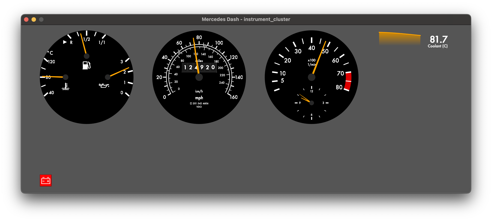
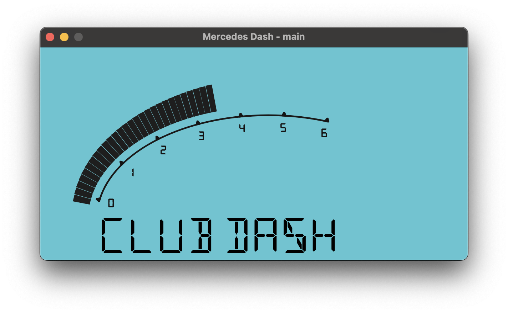
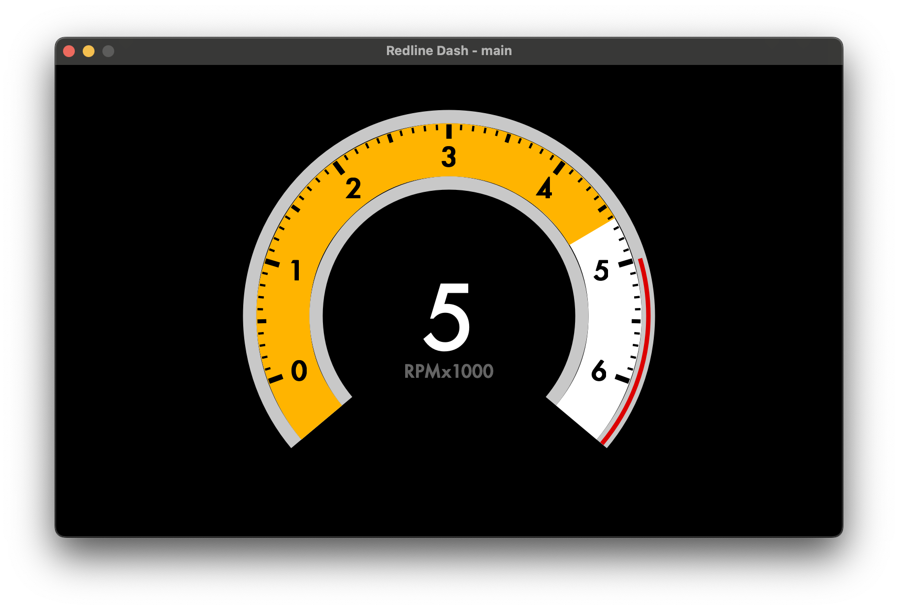
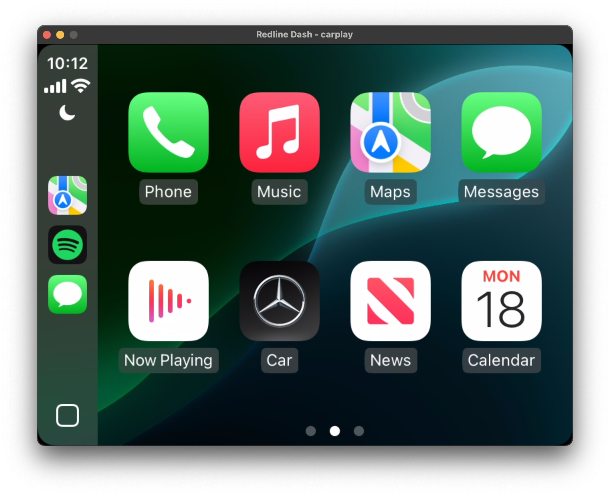

# About the project

Redline Labs Digital Dash is an open vehicle dashboard platform, in the spirit of
the Megasquirt ecosystem: an off-the-shelf baseline you can use immediately, and
a system that is easy to extend and tinker with when you want more. The software
is open source and the hardware schematics will be freely available, so you can
build, modify or integrate as you see fit.

## Software

- `dashboard`: a Qt6 application that renders fully drawn gauges and widgets, no
  static images, from a YAML layout.
- `editor`: a drag-and-drop editor for those layouts.
- `scope`: a live and recorded time-series visualizer for anything on the bus.
- `switchboard`: lists every service advertised on the bus and calls one from a
  form generated from its request schema.
- nodes: single-purpose programs that put hardware on the bus, from CAN
  adapters and ECUs to GNSS receivers, IMUs, keypads, radios and CarPlay.

Layout, widget parameters and the data behind each element are all in one YAML
file. Any signal on the bus can drive any element through an expression, and one
configuration can span several displays, for example an instrument cluster on one
screen and CarPlay on another.

## Hardware

The companion hardware is an ECU-class device designed to be equally usable
off-the-shelf and friendly to builders. Planned capabilities:

1. Drive two displays.
2. Three CAN-FD busses.
3. Ethernet: five 100BASE-T1 ports and one 100BASE-TX port.
4. Wi-Fi, as an access point or a client.
5. USB-C for laptop charging and for Ethernet and CAN-FD over the same cable.

## What that is for

Plug a laptop in over USB-C and it holds its charge, sees an Ethernet interface
bridged onto the vehicle network, and sees a USB-to-CAN interface onto any of the
CAN busses. That is one cable to tune an Ethernet-based engine controller and to
watch the CAN traffic while doing it. Over Wi-Fi the same works with no cable,
and logs can be pulled from outside the car. Unusual hardware hangs off the CAN
or Ethernet side as an expander, from any vendor or your own.

Contributions, bug reports and hardware feedback are welcome.
