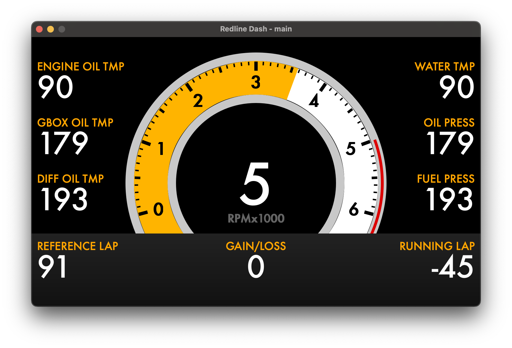

## Overview

Redline Labs Digital Dash is an open, hackable vehicle dashboard platform. The goal is to provide an off‑the‑shelf baseline you can use immediately, while making it easy to extend, customize, and tinker—very much in the spirit of the Megasquirt ecosystem. The software is fully open source, and the hardware schematics will be freely available so you can build, modify, or integrate as you see fit.

## Software

The software stack is organized in this repository:
- `dashboard`: Qt6 application that renders fully drawn widgets (no static images) for gauges and UI elements.
- `dashboard_editor`: a work‑in‑progress GUI editor for composing dashboards via drag‑and‑drop.

Key capabilities:
- Fully customizable via a configuration (YAML) that controls layout, which widgets are shown, widget parameters (for example, max RPM and shift points), and the data sources for each element.
- Pub/sub middleware (capnproto) that allows you to easily wire up new interfaces and components.
- Flexible expression parser lets you use signals in math expressions to control widget data behavior.
- Multi‑display support in a single configuration, enabling setups like an instrument cluster on one screen and a CarPlay window on another.

Screenshots (single binary, different YAML configs):

CarPlay window (requires a compatible CarlinKit dongle such as CPC200‑CCPA):

For build instructions, command‑line options, and third‑party library details, see the project README in the repository.

## Hardware

The companion hardware is an ECU‑class device designed to be equally usable off‑the‑shelf and friendly to builders. Schematics will be freely available.

Planned capabilities:
1. Drive two displays
2. Three CAN‑FD busses
3. Ethernet: five 100BASE‑T1 ports and one 100BASE‑TX port
4. Wi‑Fi (operate as either access point or client)
5. USB‑C for laptop charging and for providing Ethernet/CAN-FD connectivity.

The vision mirrors the Megasquirt model: you can obtain pre‑assembled hardware and plug it directly into your car, or build one from scratch if you prefer. Nothing in the software stack prevents modification—fork it, extend it, and tailor it to your application.

## Anticipated Use Cases
This is an attempt to explain some of the rationale behind features.
1.  Plug your laptop via USB-C.
    - Your laptop maintains its current state of charge (or slowly charges)
    - An ethernet interface is exposed over this USB connection that is bridged with the rest of the ethernet network.  This allows for tuning an ethernet based engine controller with a single USB-C cable.
    - A USB-to-CAN interface (think similar to CANable) is additionally exposed over this interface, allowing you to interact directly with any of the CAN interfaces.
2.  Connect your laptop to the controller via WiFi.
    - Similar to above, this allows tuning without any cables present, and also opening the door for log retrieval outside the vehicle.
3.  Adapt unique hardare requirements with external "expanders" using the CAN or ethernet based interfaces.
    - Allows for expansion using either readily available hardware from many different vendors, or spin your own.

## Get Involved

- Try the prebuilt examples in `configs/dashboard` to see different layouts and widgets.
- Use the YAML configuration to create your own dashboards.
- Explore the `dashboard_editor` to design layouts visually (work in progress).

Contributions, bug reports, and hardware feedback are welcome.
